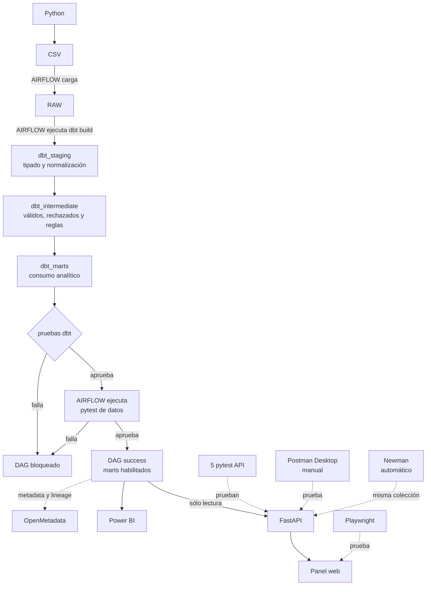

# Data QA Lab

Laboratorio reproducible de calidad de datos sobre PostgreSQL. Implementa un flujo completo desde la generación de datos hasta quality gates automatizados sobre datos, API y web.

## Objetivo

Practicar tareas transferibles a un puesto de Data QA:

- investigar datos con SQL;
- detectar nulos, duplicados, dominios inválidos y relaciones rotas;
- reconciliar capas de un pipeline;
- diseñar anomalías controladas y reproducibles;
- automatizar controles con dbt y pytest;
- bloquear pipelines cuando falla una regla;
- conservar evidencia, reportes e historial Git.

## Arquitectura

[Abrir el mapa interactivo del laboratorio](docs/diagramas/flujo-data-qa.html). Incluye una vista completa y tres vistas divididas, con explicaciones seleccionables. En una copia local del repositorio, abrilo con Chrome o con Live Server desde VS Code.



Airflow carga RAW, ejecuta un único `dbt build` y sólo habilita pytest si dbt aprueba. dbt resuelve internamente el orden entre `staging`, `intermediate` y `marts`. Postman Desktop permite probar manualmente la API y Newman automatiza esa misma colección. Playwright prueba la pantalla.

La explicación técnica y su equivalente cotidiano están desarrollados en `docs/MAPA_EJECUCION_LAB.md`.

## Stack principal

| Herramienta | Uso |
|---|---|
| PostgreSQL 15 | Almacenar RAW y los modelos construidos por dbt. |
| Python 3.12 | Generar datos y automatizar el bootstrap. |
| dbt Core 1.11 | Modelar `staging`, `intermediate` y `marts`, documentar dependencias y probar transformaciones. |
| pytest 9 | Ejecutar controles de integración, regresión y reglas de negocio. |
| Apache Airflow 3 | Orquestar el pipeline y sus quality gates. |
| FastAPI | Exponer métricas y transacciones de `dbt_marts` como API y panel web. |
| Postman y Newman | Mantener y ejecutar pruebas de contrato y escenarios negativos. |
| Playwright | Automatizar recorridos reales sobre la interfaz web. |
| Docker Compose | Ejecutar la infraestructura local de manera aislada. |
| Git y GitHub Actions | Versionar y automatizar las validaciones. |
| DBeaver y VS Code | Investigar datos y mantener código. |
| OpenMetadata | Explorar catálogo y lineage cuando se necesita. |
| Power BI Desktop | Consumir marts y reconciliar visuales con SQL y API. |

Power BI dispone de un módulo mínimo orientado a QA en `powerbi/`: conexión
real de sólo lectura, consultas M, medidas DAX y reconciliación automática contra
los marts y la API. El proyecto versionable `powerbi/Data QA Lab.pbip` incluye la
página `QA Overview`, cuatro tarjetas, la evolución diaria y el detalle filtrado de
inconsistencias. Su construcción fue un recorrido guiado de familiarización, no
una nueva responsabilidad de desarrollo BI.

## Dataset controlado

El generador utiliza una semilla fija y produce siempre:

```text
Transacciones RAW                    5000
Ítems RAW                           12000
Montos nulos controlados              100
Montos negativos controlados           75
Transacciones sin ítems               100
Montos alterados                       100
```

`dbt_intermediate` separa 4825 transacciones válidas de 175 rechazadas y conserva el motivo de cada rechazo. `dbt_marts` publica las 4825 válidas; 200 tienen una diferencia de monto deliberada y documentada.

## Controles automatizados

### dbt

El proyecto ubicado en `dbt/` crea:

```text
dbt_staging.stg_transactions
dbt_staging.stg_transaction_items
dbt_staging.stg_accounts
dbt_staging.stg_channels
dbt_staging.stg_transaction_statuses
dbt_staging.stg_products
dbt_intermediate.int_valid_transactions
dbt_intermediate.int_rejected_transactions
dbt_intermediate.int_valid_transaction_items
dbt_intermediate.int_rejected_transaction_items
dbt_intermediate.int_transaction_item_totals
dbt_marts.fct_transaction_quality
dbt_marts.mart_daily_quality
```

Resultado estable:

```text
13 modelos
6 fuentes
67 pruebas dbt
PASS=80
ERROR=0
```

Las pruebas cubren claves, nulos, relaciones, partición completa entre válidos y rechazados, motivos de rechazo, flags recalculados, reconciliación de marts y una tasa máxima configurable de inconsistencias.

### pytest

El gate de datos contiene 20 pruebas:

```text
17 passed
3 xfailed
0 failed
```

Los tres `xfail(strict=True)` representan anomalías intencionales de RAW. Si una deja de reproducirse, pytest obliga a revisar su clasificación.

Cinco pruebas adicionales validan la salud de la API, la línea base de métricas, el filtro de inconsistencias, el contrato de error `404` y la validación de parámetros.

Los gates las separan por responsabilidad:

```text
Airflow y run_quality_checks.py     20 pruebas de datos
run_app_checks.py                    5 pruebas de API
```

### API, Postman y Playwright

FastAPI consulta `dbt_marts.fct_transaction_quality` mediante conexiones forzadas a sólo lectura y publica:

```text
GET /health
GET /api/quality/summary
GET /api/transactions
GET /api/transactions/{transaction_id}
```

La interfaz web usa esos mismos endpoints. La colección Postman contiene cinco
requests y diez assertions, incluidos los contratos negativos `404` y `422`.
Newman ejecuta automáticamente ese mismo archivo. La colección y el entorno local
fueron importados y ejecutados también en Postman Desktop: cinco requests y diez
assertions pasaron desde su Runner. Playwright automatiza dos recorridos sobre
Chromium o Chrome y conserva evidencia ante fallos.

Los modos visual, Inspector y trazas, junto con la comparación entre Swagger,
Postman, Newman y Playwright, están en
`docs/GUIA_AUTOMATIZACION_API_WEB.md`.

### Airflow

Corrida estable más reciente:

```text
manual__2026-08-10T01:54:06.807302+00:00
4 de 4 tareas en success
```

También se comprobó el bloqueo del pipeline con un umbral temporal de 1 %. dbt falló en `assert_inconsistency_rate_below_threshold` y pytest no se ejecutó porque su dependencia no había aprobado.

La corrida `manual__2026-07-27T19:23:08.876914+00:00` detectó un
deadlock ocasional de PostgreSQL al recrear vistas dbt con cuatro hilos; pytest
quedó correctamente en `upstream_failed`. El defecto técnico se resolvió fijando
`threads: 1` en el perfil dbt y se verificó con la corrida estable indicada arriba.
La aceptación del 10 de agosto repitió el resultado después de detener y volver a
levantar PostgreSQL, Airflow y OpenMetadata sin eliminar sus volúmenes.

## Ejecución local

Crear el entorno e instalar dependencias:

```powershell
py -3.12 -m venv .venv
.\.venv\Scripts\python.exe -m pip install `
  --requirement requirements-generator.txt `
  --requirement requirements-dev.txt `
  --requirement requirements-dbt.txt `
  --requirement requirements-app.txt

.\.venv\Scripts\python.exe -m playwright install chromium
```

Definir la conexión sin guardar la contraseña:

```powershell
$env:QA_DB_HOST="127.0.0.1"
$env:QA_DB_PORT="5434"
$env:QA_DB_NAME="qa_lab"
$env:QA_DB_USER="qa_user"
$env:QA_DB_PASSWORD="<contraseña local>"
```

Generar los datos y construir las capas:

```powershell
.\.venv\Scripts\python.exe data_generator\generate_dataset.py
.\.venv\Scripts\python.exe scripts\bootstrap_postgres.py
.\.venv\Scripts\python.exe scripts\dbt_cli.py build --project-dir dbt --profiles-dir dbt
```

Ejecutar todos los controles y generar reportes:

```powershell
.\.venv\Scripts\python.exe scripts\run_quality_checks.py
.\.venv\Scripts\python.exe scripts\run_app_checks.py
$env:QA_BI_PASSWORD="qa_bi_pass"
.\.venv\Scripts\python.exe scripts\run_powerbi_reconciliation.py
```

## Reportes

El comando único genera:

```text
reports/
|-- summary.json
|-- dbt/
|   |-- logs/dbt.log
|   `-- target/
|       |-- manifest.json
|       `-- run_results.json
|-- pytest/
|   `-- junit.xml
|-- api/
|   `-- junit.xml
|-- playwright/
|   `-- junit.xml
|-- postman/
|   `-- junit.xml
`-- api.log
```

`reports/` se excluye de Git. GitHub Actions lo publica como artefacto temporal de cada ejecución.

## Integración continua

`.github/workflows/data-quality.yml` prepara una base PostgreSQL 15 vacía y ejecuta:

1. instalación de dependencias;
2. generación determinística del dataset;
3. carga de RAW en PostgreSQL;
4. `dbt build` y pytest de datos;
5. API temporal, pytest API, Playwright y Newman;
6. publicación de todos los reportes.

El workflow se dispara en cambios sobre `main`, ramas `feature/**`, pull requests y ejecuciones manuales. Su ejecución remota quedará habilitada cuando los commits locales se publiquen en GitHub.

## Defectos reales encontrados

Además de las anomalías deliberadas, el desarrollo permitió detectar y corregir:

- montos negativos que avanzaban desde RAW hasta la antigua capa curada;
- montos de cabecera e ítems generados de manera independiente;
- transacciones sin detalle creadas accidentalmente;
- DDL destructivos que intentaban borrar tablas utilizadas por vistas dbt.

El historial completo está en `docs/REGISTRO_DEFECTOS_LAB_QA.md`.

## Estructura relevante

```text
data-qa-lab/
|-- .github/workflows/       CI/CD
|-- app/                     API FastAPI e interfaz web
|-- data_generator/          dataset determinístico
|-- dbt/                     modelos, fuentes y pruebas dbt
|-- docs/                    plan, guía y registro de defectos
|-- e2e/                     recorridos Playwright
|-- postman/                 colección de API
|-- powerbi/                 contrato, consultas y reconciliación BI
|-- scripts/                 bootstrap y comando único de QA
|-- sql/postgres/            DDL RAW y referencia histórica de SQL legado
|-- tests/                   suite pytest
|-- pytest.ini
`-- requirements-*.txt
```

La orquestación se mantiene en el repositorio complementario `airflow-lab`.

## Documentación

- `docs/GUIA_INTRODUCTORIA_LAB_QA.md`: explicación sencilla del laboratorio.
- `docs/MAPA_EJECUCION_LAB.md`: orden exacto, responsabilidades y ejemplo cotidiano.
- `docs/PLAN_ACCION_LAB_QA.md`: avance, decisiones y validaciones.
- `docs/REGISTRO_DEFECTOS_LAB_QA.md`: defectos, evidencia y resolución.
- `docs/GUIA_GIT.md`: flujo de versionado utilizado.
- `docs/GUIA_OPERATIVA.md`: inicio, ejecución, diagnóstico y detención.
- `docs/MODO_PRACTICA_DATA_QA.md`: ejercicios, fallos controlados, recuperación y ruta de aprendizaje.
- `docs/DEFENSA_PROFESIONAL_DATA_QA.md`: explicación para entrevistas y límites del rol.

## Estado

La versión 3 local está funcional y reproducible:

- PostgreSQL y dataset estabilizados;
- flujo único `raw → dbt_staging → dbt_intermediate → dbt_marts`;
- dbt y pytest integrados como dos gates consecutivos;
- Airflow validado con éxito y fallo controlado;
- API de sólo lectura y panel web incorporados;
- Postman/Newman y Playwright integrados con cero fallas;
- proyecto Power BI versionable y reconciliado con SQL y API;
- reportes persistentes disponibles;
- CI/CD preparado localmente;
- OpenMetadata 1.12.6 recuperado sobre volumen nombrado y enriquecido desde los
  artefactos dbt: descripciones, los 67 tests dbt catalogados con sus resultados
  y 23 mapeos críticos de columnas;
- documentación de portfolio actualizada.
- modo práctica preparado con 15 ejercicios y defensa profesional basada en evidencia.

La publicación en GitHub y la primera ejecución remota del workflow requieren una autorización separada.
