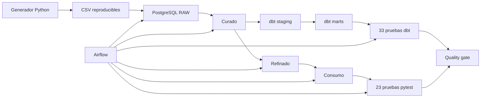

# Data QA Lab

Laboratorio reproducible de calidad de datos sobre PostgreSQL. Implementa un flujo completo desde la generación de datos hasta quality gates automatizados con dbt, pytest, Airflow y GitHub Actions.

## Objetivo

Practicar tareas transferibles a un puesto de Data QA:

- investigar datos con SQL;
- detectar nulos, duplicados, dominios inválidos y relaciones rotas;
- reconciliar capas de un pipeline;
- diseñar anomalías controladas y reproducibles;
- automatizar controles con dbt y pytest;
- bloquear pipelines cuando falla una regla;
- conservar evidencia, reportes e historial Git.

## Arquitectura



Airflow orquesta once tareas. `dbt build` se ejecuta antes de pytest; si cualquiera de los dos devuelve un error, el DAG queda bloqueado.

## Stack principal

| Herramienta | Uso |
|---|---|
| PostgreSQL 15 | Almacenar las capas y ejecutar reglas SQL. |
| Python 3.12 | Generar datos y automatizar el bootstrap. |
| dbt Core 1.11 | Modelar `staging` y `marts`, documentar dependencias y probar transformaciones. |
| pytest 9 | Ejecutar controles de integración, regresión y reglas de negocio. |
| Apache Airflow 3 | Orquestar el pipeline y sus quality gates. |
| Docker Compose | Ejecutar la infraestructura local de manera aislada. |
| Git y GitHub Actions | Versionar y automatizar las validaciones. |
| DBeaver y VS Code | Investigar datos y mantener código. |
| OpenMetadata | Explorar catálogo y lineage cuando se necesita. |

## Dataset controlado

El generador utiliza una semilla fija y produce siempre:

```text
Transacciones RAW                    5000
Ítems RAW                           12000
Montos nulos controlados              100
Montos negativos controlados           75
Transacciones sin ítems               100
Montos alterados                       100
```

La capa curada rechaza montos nulos y negativos. Las capas refinada, consumo y dbt conservan 4825 transacciones, de las cuales 200 tienen una diferencia de monto deliberada y documentada.

## Controles automatizados

### dbt

El proyecto ubicado en `dbt/` crea:

```text
dbt_staging.stg_transactions
dbt_staging.stg_transaction_items
dbt_marts.fct_transaction_quality
dbt_marts.mart_daily_quality
```

Resultado estable:

```text
4 modelos
2 fuentes
33 pruebas
PASS=37
ERROR=0
```

Las pruebas cubren claves, nulos, relaciones, flags recalculados, reconciliación con consumo y una tasa máxima configurable de inconsistencias.

### pytest

La suite contiene 23 pruebas:

```text
19 passed
4 xfailed
0 failed
```

Los cuatro `xfail(strict=True)` representan anomalías intencionales del dataset. Si una deja de reproducirse, pytest obliga a revisar su clasificación.

### Airflow

Corrida estable más reciente:

```text
dbt_gate_recovery_20260726T1536Z
11 de 11 tareas en success
```

También se comprobó el bloqueo del pipeline con un umbral temporal de 1 %. dbt falló en `assert_inconsistency_rate_below_threshold` y pytest no se ejecutó porque su dependencia no había aprobado.

## Ejecución local

Crear el entorno e instalar dependencias:

```powershell
py -3.12 -m venv .venv
.\.venv\Scripts\python.exe -m pip install `
  --requirement requirements-generator.txt `
  --requirement requirements-dev.txt `
  --requirement requirements-dbt.txt
```

Definir la conexión sin guardar la contraseña:

```powershell
$env:QA_DB_HOST="127.0.0.1"
$env:QA_DB_PORT="5434"
$env:QA_DB_NAME="qa_lab"
$env:QA_DB_USER="qa_user"
$env:QA_DB_PASSWORD="<contraseña local>"
```

Generar los datos y construir las capas:

```powershell
.\.venv\Scripts\python.exe data_generator\generate_dataset.py
.\.venv\Scripts\python.exe scripts\bootstrap_postgres.py
```

Ejecutar todos los controles y generar reportes:

```powershell
.\.venv\Scripts\python.exe scripts\run_quality_checks.py
```

## Reportes

El comando único genera:

```text
reports/
|-- summary.json
|-- dbt/
|   |-- logs/dbt.log
|   `-- target/
|       |-- manifest.json
|       `-- run_results.json
`-- pytest/
    `-- junit.xml
```

`reports/` se excluye de Git. GitHub Actions lo publica como artefacto temporal de cada ejecución.

## Integración continua

`.github/workflows/data-quality.yml` prepara una base PostgreSQL 15 vacía y ejecuta:

1. instalación de dependencias;
2. generación determinística del dataset;
3. bootstrap completo de PostgreSQL;
4. `dbt build`;
5. pytest;
6. publicación de reportes.

El workflow se dispara en cambios sobre `main`, ramas `feature/**`, pull requests y ejecuciones manuales. Su ejecución remota quedará habilitada cuando los commits locales se publiquen en GitHub.

## Defectos reales encontrados

Además de las anomalías deliberadas, el desarrollo permitió detectar y corregir:

- montos negativos que avanzaban desde RAW hasta curado;
- montos de cabecera e ítems generados de manera independiente;
- transacciones sin detalle creadas accidentalmente;
- DDL destructivos que intentaban borrar tablas utilizadas por vistas dbt.

El historial completo está en `docs/REGISTRO_DEFECTOS_LAB_QA.md`.

## Estructura relevante

```text
data-qa-lab/
|-- .github/workflows/       CI/CD
|-- data_generator/          dataset determinístico
|-- dbt/                     modelos, fuentes y pruebas dbt
|-- docs/                    plan, guía y registro de defectos
|-- scripts/                 bootstrap y comando único de QA
|-- sql/postgres/            DDL y transformaciones por capas
|-- tests/                   suite pytest
|-- pytest.ini
`-- requirements-*.txt
```

La orquestación se mantiene en el repositorio complementario `airflow-lab`.

## Documentación

- `docs/GUIA_INTRODUCTORIA_LAB_QA.md`: explicación sencilla del laboratorio.
- `docs/PLAN_ACCION_LAB_QA.md`: avance, decisiones y validaciones.
- `docs/REGISTRO_DEFECTOS_LAB_QA.md`: defectos, evidencia y resolución.
- `docs/GUIA_GIT.md`: flujo de versionado utilizado.
- `docs/GUIA_OPERATIVA.md`: inicio, ejecución, diagnóstico y detención.

## Estado

La versión 1 local está funcional y reproducible:

- PostgreSQL y dataset estabilizados;
- dbt y pytest integrados;
- Airflow validado con éxito y fallo controlado;
- reportes persistentes disponibles;
- CI/CD preparado localmente;
- documentación de portfolio actualizada.

La publicación en GitHub y la primera ejecución remota del workflow requieren una autorización separada. API, Postman, interfaz web y Playwright quedan como una posible segunda etapa.
