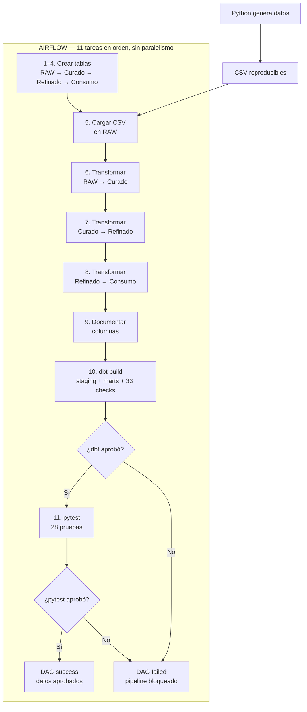
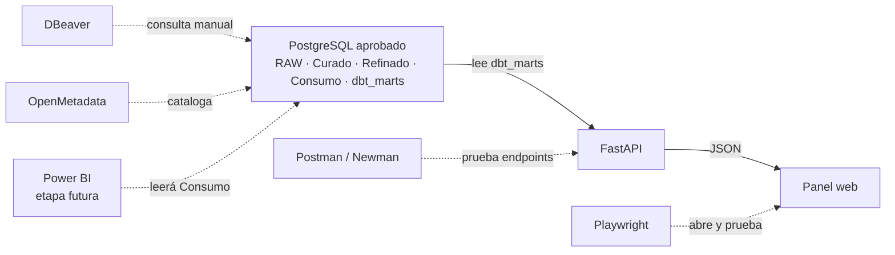

# Mapa de ejecución del laboratorio

## Qué tipo de diagrama es

Este documento muestra arquitectura y orden de ejecución. No es un DER: un diagrama entidad-relación mostraría tablas, claves y relaciones, pero no explicaría qué programa ejecuta cada paso ni cuándo ocurre.

Se utilizan dos mapas porque mezclar el pipeline de datos con la aplicación hacía parecer que todas las herramientas trabajaban simultáneamente.

## 1. Pipeline de datos controlado por Airflow



### Qué significa técnicamente

Airflow contiene la lista de tareas y sus dependencias. Una tarea sólo comienza cuando la anterior terminó correctamente.

1. Python genera previamente los archivos CSV. La generación no es una tarea del DAG actual.
2. Airflow crea las tablas necesarias una por una.
3. Carga los CSV en las tablas RAW.
4. Ejecuta tres transformaciones SQL, cada una después de la anterior.
5. Agrega comentarios técnicos a las columnas.
6. Ejecuta `dbt build`: crea `dbt_staging`, crea `dbt_marts` y realiza 33 checks.
7. Si dbt falla, Airflow detiene el DAG y pytest no se ejecuta.
8. Si dbt aprueba, Airflow ejecuta las 28 pruebas pytest.
9. El DAG sólo termina en `success` si pytest también aprueba.

Los cuatro `xfailed` de pytest son defectos conocidos y controlados. No bloquean el pipeline. Un `failed` inesperado sí lo bloquea.

### Ejemplo cotidiano

Imaginemos un depósito que recibe mercadería:

- **Python** es la fábrica que prepara los paquetes y la lista de envío.
- **Los CSV** son los camiones que llegan con esos paquetes.
- **PostgreSQL** es el depósito, dividido en sectores.
- **RAW** es la zona de recepción: se guarda lo que llegó, incluso si algo vino mal.
- **Curado** es el primer control, donde se rechazan paquetes inválidos.
- **Refinado** pesa y compara cada paquete con su detalle.
- **Consumo** es la góndola ordenada que utilizarán otras personas.
- **Airflow** es el encargado con una lista numerada. No inspecciona personalmente cada producto: indica qué empleado trabaja, espera que termine y recién entonces habilita el paso siguiente.
- **dbt** es el especialista que arma una sección analítica del depósito y comprueba sus estructuras.
- **pytest** es el auditor final. Si encuentra un problema crítico, no firma la habilitación.

Por eso Airflow no es otra etapa de los datos. Es quien controla el orden y decide si el proceso puede continuar según el resultado de cada tarea.

## 2. Aplicación y pruebas posteriores



### Qué significa técnicamente

- FastAPI consulta `dbt_marts` mediante conexiones forzadas a sólo lectura.
- El panel web le solicita información a FastAPI y presenta el resultado.
- Newman envía requests a FastAPI y valida códigos HTTP, contratos y métricas.
- Playwright abre el panel en Chromium y comprueba lo que ve un usuario.
- DBeaver permite investigar manualmente las tablas.
- OpenMetadata registra catálogo y lineage; no ejecuta ni bloquea el pipeline.
- Power BI se conectará a consumo en una etapa futura.

Postman y Playwright no son tareas del DAG de Airflow. El comando `scripts/run_app_checks.py` realiza otro recorrido:

```text
iniciar FastAPI
    ↓
esperar que /health responda correctamente
    ↓
ejecutar Playwright
    ↓
ejecutar Newman
    ↓
detener FastAPI
```

### Ejemplo cotidiano

Una vez que el auditor habilitó el depósito:

- **FastAPI** es la recepcionista que consulta el inventario y responde preguntas, pero no puede modificarlo.
- **La web** es la pantalla de atención que traduce esas respuestas a algo fácil de leer.
- **Postman/Newman** llama a la recepcionista con preguntas preparadas y verifica que responda correctamente.
- **Playwright** actúa como un cliente de prueba: entra, mira la pantalla, usa el filtro y comprueba el resultado.
- **DBeaver** es la lupa del investigador que entra al depósito para revisar registros.
- **OpenMetadata** es el mapa y catálogo del edificio.
- **Power BI** será el tablero gerencial que resume lo disponible.

## 3. Qué ocurre al mismo tiempo

| Situación | ¿Hay simultaneidad? |
|---|---|
| Tareas del DAG actual | No. Las 11 tareas están encadenadas y se ejecutan una después de otra. |
| Contenedores Docker | Sí. Los servicios permanecen encendidos al mismo tiempo, esperando trabajo. |
| Carga inicial del panel web | Sí. El navegador solicita salud, resumen y transacciones casi al mismo tiempo. |
| Playwright y Newman | No en el runner actual. Primero se ejecuta Playwright y después Newman. |
| OpenMetadata y DBeaver | Pueden consultar mientras PostgreSQL está activo, pero no controlan Airflow. |
| Git | No participa en la ejecución. Conserva el historial de los archivos. |
| GitHub Actions | Es una ejecución alternativa y aislada; no dirige el Airflow local. |

## 4. Las tres preguntas para ubicar cada herramienta

Cuando aparezca una herramienta, conviene preguntarse:

1. **¿Mueve o transforma datos?** Python, SQL y dbt.
2. **¿Ordena o decide si continuar?** Airflow y los quality gates.
3. **¿Consulta, prueba u observa el resultado?** FastAPI, web, Postman, Playwright, DBeaver, OpenMetadata y Power BI.

Una herramienta puede participar en más de una categoría. Por ejemplo, dbt transforma datos y además ejecuta checks; Airflow interpreta su código de salida para decidir si continúa.
