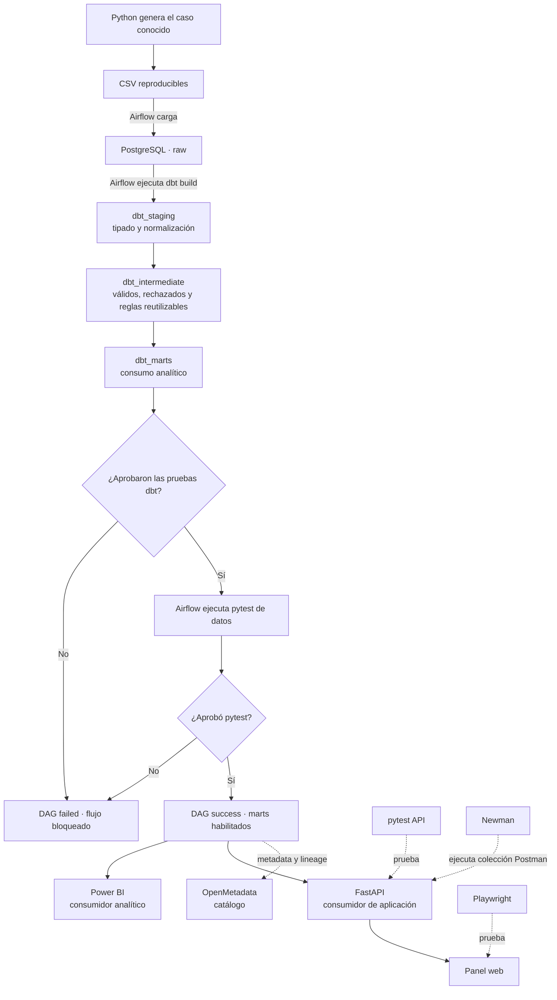

# Mapa de ejecución del laboratorio

[Abrir la versión interactiva](diagramas/flujo-data-qa.html). Incluye el mapa completo y tres vistas divididas con explicaciones seleccionables.

## Vista completa

## Qué hace cada tramo

1. Python genera siempre el mismo caso de prueba.
2. Airflow carga los CSV en `raw`.
3. Airflow inicia `dbt build` una sola vez.
4. dbt calcula el orden por sus referencias: `staging → intermediate → marts`.
5. Dentro del mismo build, dbt ejecuta las pruebas asociadas a cada modelo.
6. Si dbt falla, la tarea termina y Airflow no inicia pytest.
7. Si dbt aprueba, Airflow ejecuta pytest como segundo gate de integración.
8. Sólo con ambos gates aprobados el DAG termina en `success`.
9. Power BI y FastAPI pueden consultar los marts; OpenMetadata cataloga su estructura y linaje.

Airflow no transforma datos por sí mismo y tampoco vuelve a tomar el control entre cada modelo dbt. Ejecuta `dbt build`, espera su código de salida y decide si habilita la siguiente tarea.

## Qué representa cada esquema

| Esquema | Responsabilidad |
|---|---|
| `raw` | Conserva la entrada recibida, incluidos defectos intencionales. |
| `dbt_staging` | Renombra, tipa y normaliza cada fuente sin ocultar filas. |
| `dbt_intermediate` | Aplica reglas reutilizables, separa válidos/rechazados y guarda motivos. |
| `dbt_marts` | Publica modelos listos para API, BI y otros consumidores. |

La implementación anterior `raw → curado → refinado → consumo` quedó fuera del pipeline activo. Sus SQL se conservan en `sql/postgres/legacy/` únicamente para comparar el enfoque manual con dbt.

## Por qué existen dos gates

No son dos copias del mismo test:

| Gate | Alcance |
|---|---|
| dbt | Comprueba los modelos mientras se construyen: columnas, relaciones, dominios y reglas SQL cercanas a la transformación. |
| pytest de datos | Verifica el resultado integrado: conteos entre etapas, particiones completos, rechazos explicados y reconciliación final. |
| GitHub Actions | No agrega un tercer tipo de regla; repite dbt y pytest desde cero en un entorno aislado antes de aceptar cambios. |

Localmente se prueba el trabajo en desarrollo. GitHub Actions confirma que el mismo cambio también funciona fuera de la computadora y sin depender de estado previo.

## Controles de aplicación

Cuando los marts están disponibles:

| Herramienta | Objetivo |
|---|---|
| pytest API | Contrato, respuestas, filtros y errores de FastAPI. |
| Postman Desktop | Exploración manual de los endpoints. |
| Newman | Ejecución automática de la misma colección Postman. |
| Playwright | Comportamiento visible del panel web. |

Postman/Newman prueban principalmente la API. Playwright prueba la experiencia web.

## Herramientas que observan

- DBeaver permite consultar los esquemas, investigar filas y reunir evidencia; no controla el DAG.
- OpenMetadata lee tablas, columnas y linaje; no recibe los registros como consumidor de negocio.
- Power BI consulta `dbt_marts`; no necesita una segunda capa llamada `consumo`.
- Git conserva versiones de SQL, pruebas, DAGs y documentación.
- Docker mantiene los servicios aislados y puede encenderlos o apagarlos sin borrar sus volúmenes.

## Qué ocurre al mismo tiempo

| Situación | Comportamiento |
|---|---|
| Tareas del DAG | Secuenciales: carga RAW, dbt y pytest. |
| Modelos dbt | dbt respeta dependencias. Este lab usa un hilo para que el orden sea reproducible y evitar bloqueos al recrear vistas. |
| Contenedores | Permanecen encendidos al mismo tiempo esperando trabajo. |
| Destinos aprobados | Power BI, FastAPI y OpenMetadata son ramas independientes. |
| Controles de aplicación | El runner actual los ejecuta uno después del otro. |
| DBeaver | Puede consultar mientras PostgreSQL está activo. |
